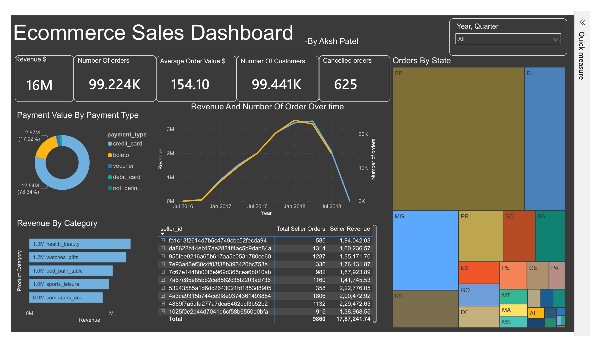

# E-Commerce Analytics Project

This project analyzes an e-commerce business dataset using PostgreSQL, SQL, Python, Jupyter Notebook, and Power BI. The goal is to convert raw transactional data into business insights that help explain revenue performance, customer behavior, payment preferences, delivery issues, seller concentration, and category-level risk.

## Business Problem

E-commerce teams usually have data spread across customers, orders, payments, products, reviews, sellers, and logistics. This project brings those sources together to answer the core business questions below:

- Which product categories generate the most revenue?
- Which customer states and product categories produce the highest average order value?
- How do payment methods influence revenue collection?
- When do customers place the most orders?
- Do delivery delays reduce customer satisfaction?
- Which sellers are highly dependent on a single category?
- Which categories show higher cancellation risk over time?

In short, this project helps the business understand what drives growth, where customer experience is breaking down, and where operational or commercial action is needed.

## Dashboard Preview

The dashboard image below was extracted from [dashboard/dashboard.pdf](dashboard/dashboard.pdf).



## What The Dashboard Highlights

- Total revenue of about `16M`.
- Around `99.224K` delivered/processed orders.
- Average order value of `154.10`.
- Roughly `99.441K` customers.
- `625` cancelled orders in the dashboard snapshot.
- Credit card payments dominate total payment value, followed by boleto.
- Revenue is concentrated in major categories such as `health_beauty`, `watches_gifts`, `bed_bath_table`, `sports_leisure`, and `computers_accessories`.
- Order volume is heavily concentrated in states such as `SP`, `RJ`, and `MG`.

## Analytical Queries Covered

The project includes SQL analysis in [query.sql](query.sql) and executable notebook versions in [query_execution.ipynb](query_execution.ipynb).

1. Monthly GMV trend with month-over-month growth percentage.
2. Average order value by product category and customer state.
3. Top 10 product categories by revenue.
4. Average review score by product category and customer state.
5. Average freight cost as a percentage of product price by category.
6. Revenue by payment type and by full-payment vs installment behavior.
7. Order volume by hour of day and day of week.
8. Customer repeat purchase analysis.
9. Impact of delivery delay on review scores by category.
10. Seller specialization analysis for sellers earning 70%+ revenue from one category.
11. Order cancellation rate by product category and month.

## Business Questions Answered

- Revenue performance: Which categories and months contribute the most to GMV?
- Market segmentation: Which states and categories show stronger monetization through higher AOV?
- Customer experience: Are delayed deliveries associated with weaker review scores?
- Operations and logistics: Which categories carry a higher freight burden or cancellation rate?
- Payment strategy: Which payment methods contribute most revenue, and how important are installments?
- Demand planning: What are the peak ordering days and hours?
- Seller management: Which sellers are over-specialized and exposed to category-specific risk?

## Dataset Snapshot

This project uses the Olist-style e-commerce dataset stored in the [`data/`](data) folder.

| File | Description | Rows |
| --- | --- | ---: |
| `customers.csv` | Customer and location data | 99,441 |
| `sellers.csv` | Seller information | 3,095 |
| `products.csv` | Product attributes and category mapping | 32,951 |
| `orders.csv` | Order lifecycle timestamps and status | 99,441 |
| `order_items.csv` | Order line items with seller and freight values | 112,650 |
| `order_payments.csv` | Payment method and payment value details | 103,886 |
| `order_reviews.csv` | Customer review scores and comments | 104,719 |
| `geolocation.csv` | Geographic reference data | 1,000,163 |
| `product_category_name_translation.csv` | Portuguese-to-English category mapping | 71 |

Order purchase dates in the dataset range from `2016-09-04` to `2018-10-17`.

## Project Structure

```text
Ecommerce_Analytics/
|-- data/
|-- dashboard/
|   |-- dashboard.pdf
|   |-- dashboard-preview.png
|   `-- Ecommerce dashboard.pbit
|-- load_data.ipynb
|-- query.sql
|-- query_execution.ipynb
`-- README.md
```

## Tools And Workflow

- `load_data.ipynb`: Creates the `olist` schema in PostgreSQL and loads the CSV files.
- `query.sql`: Stores the main SQL business queries.
- `query_execution.ipynb`: Runs the analytical queries and displays results inside Jupyter.
- `dashboard/Ecommerce dashboard.pbit`: Power BI template for the dashboard.
- `dashboard/dashboard.pdf`: Exported dashboard report.

## Tech Stack

- PostgreSQL
- SQL
- Python
- Pandas
- SQLAlchemy
- Jupyter Notebook
- Power BI

## How To Run

1. Create a PostgreSQL database for the project.
2. Update the database connection details in [load_data.ipynb](load_data.ipynb) and [query_execution.ipynb](query_execution.ipynb).
3. Run `load_data.ipynb` to create tables and load the CSV data into the `olist` schema.
4. Run `query_execution.ipynb` to execute the analytical SQL queries.
5. Open `dashboard/Ecommerce dashboard.pbit` in Power BI to view or extend the dashboard.

## Outcome

This project turns raw e-commerce transaction data into a business intelligence solution that supports:

- revenue and category performance tracking,
- customer and regional behavior analysis,
- payment and pricing insight,
- logistics and service-quality monitoring,
- and seller-level performance evaluation.

It is a complete business analytics workflow covering data loading, SQL analysis, and dashboard-based storytelling.
